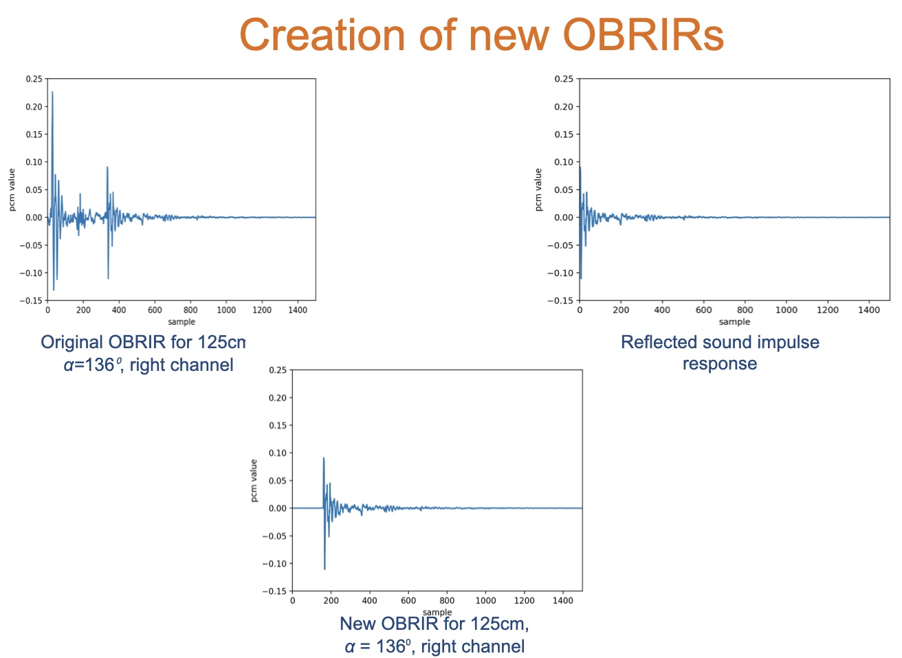
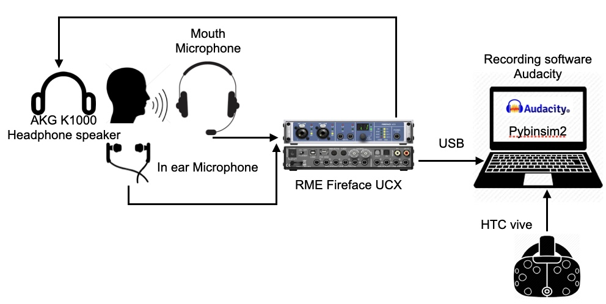

# virtual-wall: Investigating the perception of a nearby wall by exploring the virtual room with self produced oral sounds.

## Overview
This is a research project that explores human echolocation within a Virtual Acoustic Environment (VAE), examining how individuals perceive a nearby wall and obstacle using self sounds, similar to vison-impaired individuals.  
 
 For more information please check our report and slides.

## Features
- Real-time audio processing using self-produced speech.
- Implementation of Oral Binaural Room Impulse Response (OBRIR) for characterizing the room acoustics.
- Integration with Pybinsim, a python-based convolution system, to simulate virtual acoustic spaces.
- Use of HTC Vive for head tracking and interactive listening tests.
- Real-time convolution algorithm that updates OBRIR filters based on tracking data.
- Listening tests to evaluate perception of a nearby virtual wall.

### Figure 1.

### Figure 2.

## Technical Specifications
- Pybinsim (see the origin project here: https://github.com/pyBinSim/pyBinSim)
- HTC Vive (head position and orientation data tracking)
- Python 3.5+
